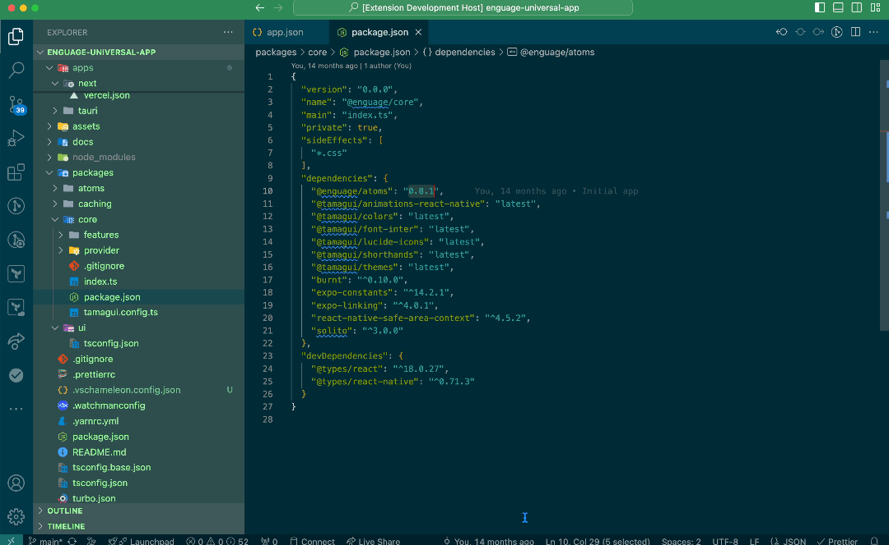

<p align="center">
  
</p>

# 🦎 VSChameleon 🦎

VSChameleon is a Visual Studio Code extension designed to dynamically customize the editor and workspace colors based on the active file's context. Tailored for developers working on monrepos, this extension ensures that your workspace visually adapts to your file's location (e.g., `frontend`, `backend`), offering an intuitive and pleasant coding experience ✨

<p align="center">
  
</p>

## Purpose

VSChameleon helps distinguish different parts of your project by dynamically applying color themes and decorations. This visual cue reduces cognitive load and helps prevent accidental edits in the wrong files by making your workspace visually distinct.

## Features

- **Dynamic Theme Switching**: Automatically changes the color theme based on the active file's path.
- **Color Customizations**: Configure the "colorCustomizations" properties of your workspace `settings.json` based on the active file's path.
- **Configurable Matching**: Use regex patterns to define custom rules for your files.
- **Reset to Default**: Automatically resets themes and colors when no matching rules are found.
- **Lightweight and Flexible**: Minimal impact on VS Code performance.

## Installation

1. Download and install VSChameleon from the [Visual Studio Code Marketplace](https://marketplace.visualstudio.com/).
2. Open Visual Studio Code and enable the extension.

Alternatively, install the `.vsix` package directly:

```bash
code --install-extension vschameleon-x.x.x.vsix
```

## Configuration

The extension uses a JSON configuration file (`.vschameleon.config.json`) stored in your project root to define how themes and colors are applied.

### Configuration File Structure

```json
{
  "workspaces": {
    "frontend": {
      "match": "^frontend/.*",
      "colors": {
        "titleBar.activeBackground": "#00008B",
        "titleBar.activeForeground": "#FFFFFF",
        "sideBar.background": "#F0F8FF"
      },
      "theme": "Light+ (default light)"
    },
    "backend": {
      "match": "^backend/.*",
      "colors": {
        "titleBar.activeBackground": "#006400",
        "titleBar.activeForeground": "#FFFFFF",
        "sideBar.background": "#F5FFFA"
      },
      "theme": "Dark+ (default dark)"
    }
  }
}
```

### Key Properties

- **`workspaces`**: A collection of workspace configurations.
  - **`match`**: Regex to match file paths (relative to the root of the workspace directory).
  - **`colors`**: Object defining []`workbench.colorCustomizations`](https://code.visualstudio.com/api/references/theme-color) for the matched files.
  - **`theme`**: The name of the VS Code theme to apply for matched files.

### Default Theme Reset

When no matching configuration is found, VSChameleon resets to the theme active when the extension was initialized.

## Usage

1. Create a `.vschameleon.config.json` file in your project root.
2. Define your `workspaces` with file path regexes, colors, and themes.
3. Reload your developer window.
4. Open a file in your workspace, and VSChameleon will automatically adjust the colors and theme based on your configuration.

## Examples

### Frontend and Backend Project

- Files in the `/frontend/` directory have a light blue sidebar and use the "Light+" theme.
- Files in the `/backend/` directory have a green title bar and use the "Dark+" theme.

### Example Config

```json
{
  "workspaces": {
    "frontend": {
      "match": "^frontend/.*",
      "colors": {
        "titleBar.activeBackground": "#1E90FF",
        "titleBar.inactiveBackground": "#87CEFA",
        "titleBar.activeForeground": "#FFFFFF",
        "titleBar.inactiveForeground": "#F0F8FF",
        "sideBar.foreground": "#1E90FF"
      },
      "theme": "Light+ (default light)"
    },
    "backend": {
      "match": "^backend/.*",
      "colors": {
        "titleBar.activeBackground": "#2E8B57",
        "titleBar.inactiveBackground": "#98FB98",
        "titleBar.activeForeground": "#FFFFFF",
        "titleBar.inactiveForeground": "#F5FFFA",
        "sideBar.background": "#2F4F4F",
        "sideBar.foreground": "#98FB98"
      },
      "theme": "Dark+ (default dark)"
    }
  }
}
```

## Debugging and Logs

Logs for VSChameleon can be found in the VS Code "Output" panel under the "VSChameleon" section.

## Contributing

1. Fork the repository.
2. Create your feature branch: `git checkout -b feature/my-feature`.
3. Commit your changes: `git commit -m 'Add my feature'`.
4. Push to the branch: `git push origin feature/my-feature`.
5. Open a pull request.

### Known Issues

- **Unsaved `settings.json` Changes**: Frequent updates to the workspace configuration can leave unsaved changes. Consider using in-memory updates if persistent changes are not required.
- **Cannot Use PNPM**: I started the project using `pnpm`, but when running `vsce package`, ran into some issues with dependencies. Using `npm` instead fixed the issues.

## License

This project is licensed under the MIT License. See the [LICENSE](LICENSE) file for details.

## Feedback and Support

For bugs, feature requests, or feedback, please create an issue in the [GitHub repository](https://github.com/JamesDHW/vschameleon).
